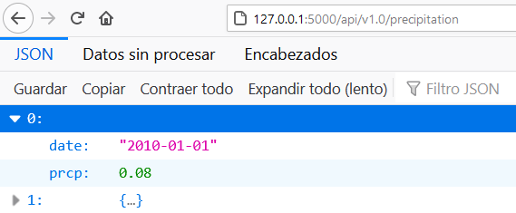
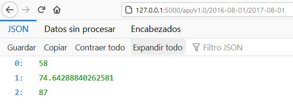

# SQLAlchemy-challenge
### Data App: Query database, Analyse data & Share results through API

#### Description
The scope of this project is to query sample weather data stored in a database, perform a basic climate analysis and make results available delivering a JSON response through a Web API (Application Programming Interface).

#### Script Summary
This script takes advantage of Python & SQLAlchemy ORM (Object Relational Mapper) to query data from a SQLite database. The analysis was performed in Jupyter Notebook using Pandas and Matplotlib for data visualization. Flask framework was used to build the web API.

#### Workflow

##### 1. Database Query
+ Use SQLAlchemy `create_engine` to connect to SQLite database.
+ Use SQLAlchemy `automap_base()` to reflect DB tables into classes and save reference for `Station` and `Measurement` classes.
+ Link Python to DB by creating an SQLAlchemy session.

##### 2. Data Analysis
+ **Precipitation Analysis**
    - Retrieve last 12 months of precipitation data.
    - Sort values by `date`.
    - Plot results.

+ **Precipitation Analysis**
    - Compute total number of weather stations in dataset.
    - List stations and observation counts (descending order).
    - For most active station:
        - Calculate lowest, average and highest temperature.
        - Retrieve last 12 months of temperature observation data (TOBS).
        - Plot results as histogram.

##### 3. Web App

Design Flask API to share data analysis results delivering a JSON response through a Web Application.
+ **Static routes:**
    - /api/v1.0/precipitation
    - /api/v1.0/stations
    - /api/v1.0/tobs

+ **Dynamic routes:**
    - api/v1.0/<start>
    - /api/v1.0/<start>/<end>

##### 4. Additional Analysis

| Trip Avg Temp | Daily Temperature Normals (min-avg-max) |
| --- | --- |
|  |  |

#### Note:

+ Jupyter Notebooks `1_Climate_Analysis.ipynb` , `3_Temperature_Analysis_1.ipynb` and `4_Temperature_Analysis_2.ipynb` are not correctly displayed in the GitHub interface. It is strongly suggested to download related files in order to run them natively.