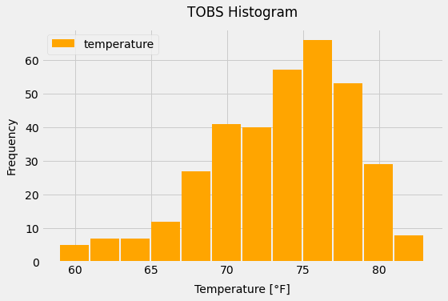
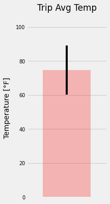
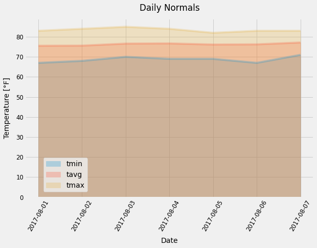

# SQLAlchemy-challenge
### Data App: Query database, Analyse data & Share results through API

#### Description
The scope of this project is to query sample weather data stored in a database, perform a basic climate analysis and make results available delivering a JSON response through a Web API (Application Programming Interface).

#### Script Summary
This script takes advantage of Python & SQLAlchemy ORM (Object Relational Mapper) to query data from a SQLite database. The analysis was performed in Jupyter Notebook using Pandas and Matplotlib for data visualization. Flask framework was used to build the web API.

#### Workflow

##### 1. Query database
+ Use SQLAlchemy `create_engine` to connect to SQLite database.
+ Use SQLAlchemy `automap_base()` to reflect DB tables into classes and save reference for `Station` and `Measurement` classes.
+ Link Python to DB by creating an SQLAlchemy session.

##### 2. Data Analysis
+ **Precipitation Analysis**
    - Find most recent date in dataset.
    - From last date retrieve the 12 preceding months of precipitation data.
    - Sort values by `date`.
    - Plot results 

| Precipitation values (last 12 months) |
| --- |
|  |

##### FLASK

##### t-test

ABC

| Temperature Observation Data (TOBS) Histogram |
| --- |
|  |

ABC

| Trip Avg Temp | Daily Temperature Normals (min-avg-max) |
| --- | --- |
|  |  |
