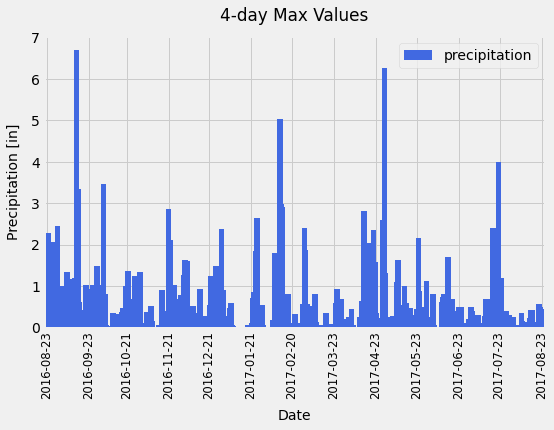
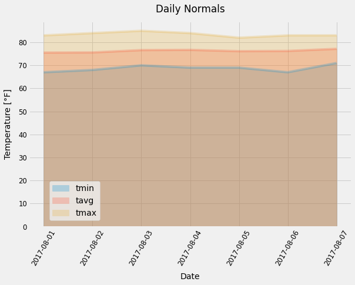

# SQLAlchemy-challenge
### Data App: Query database, Analyse data & Share results through API

#### Description
The scope of this project is to query sample weather data stored in a database, perform a basic climate analysis and make results available delivering a JSON response through a Web API (Application Programming Interface).

#### Script Summary
This script takes advantage of Python & SQLAlchemy ORM (Object Relational Mapper) to query data from a SQLite database. The analysis was performed in Jupyter Notebook using Pandas and Matplotlib for data visualization. Flask framework was used to build the web API.

#### Workflow

ABC

| Precipitation Analysis |
| --- |
|  |

##### FLASK

##### t-test

ABC

| Temperature Observation Data (TOBS) Histogram |
| --- |
|  |

ABC

| Trip Avg Temp | Daily Temperature Normals (min-avg-max) |
| --- | --- |
|  | ! |
